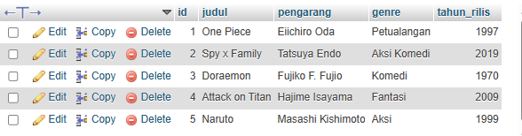

# 📘 Deskripsi Proyek
Program ini merupakan implementasi konsep Multithreading dan Java Database Connectivity (JDBC) untuk menghubungkan aplikasi Java dengan MySQL (melalui XAMPP).
Setiap thread bertugas menambahkan data komik ke dalam database secara paralel, sehingga proses penambahan dapat berjalan secara bersamaan.

# ⚙️ Fitur Utama
- Menghubungkan Java ke MySQL menggunakan JDBC.
- Menggunakan konsep Thread untuk menambahkan data komik secara paralel.
- Menampilkan status koneksi dan hasil operasi pada console.
- Menyimpan data komik (judul, pengarang, genre, tahun rilis) ke dalam tabel komik.

# 🧱 Struktur Tabel Database
Database: komik_db

Tabel: komik

`Kolom	Tipe Data	Keterangan`

`id	INT (Auto Increment)	Primary Key`

`judul	VARCHAR(100)	Judul komik`

`pengarang	VARCHAR(100)	Nama pengarang`

`genre	VARCHAR(50)	Genre komik`

`tahun_rilis	INT	Tahun rilis komik`

# 💻 Langkah Menjalankan Program
1. Persiapan Database
- Jalankan XAMPP, aktifkan Apache dan MySQL.
- Buka phpMyAdmin → buat database baru dengan nama: `komik_db`
- Jalankan SQL berikut untuk membuat tabel:

` CREATE TABLE komik (`
  
 ` id INT AUTO_INCREMENT PRIMARY KEY,`
  
 ` judul VARCHAR(100),`

 ` pengarang VARCHAR(100),`
 
 ` genre VARCHAR(50),`
 
 ` tahun_rilis INT`

`);`

2. Konfigurasi JDBC di Kode Java
- Pastikan koneksi JDBC di file DBConnection.java seperti ini:

`String url = "jdbc:mysql://localhost:3306/komik_db";`

`String user = "root";`

`String password = "";`

- Sesuaikan user dan password sesuai konfigurasi XAMPP kamu.

3. Jalankan Program
- Jalankan file MainApp.java melalui Eclipse, IntelliJ, atau terminal: java MainApp
- Jika berhasil, akan muncul output seperti ini di console:

`? Koneksi ke MySQL berhasil!`

`? Komik "Naruto" berhasil ditambahkan oleh thread: Thread-1`

`? Komik "Attack on Titan" berhasil ditambahkan oleh thread: Thread-3`

`? Komik "One Piece" berhasil ditambahkan oleh thread: Thread-0`

`? Komik "Doraemon" berhasil ditambahkan oleh thread: Thread-2`

`? Komik "Spy x Family" berhasil ditambahkan oleh thread: Thread-4`

# 🧠 Konsep yang Diterapkan
- Multithreading
Setiap proses penambahan komik berjalan pada thread yang berbeda menggunakan kelas Thread, agar eksekusi berjalan paralel.

- JDBC (Java Database Connectivity)
JDBC digunakan untuk menghubungkan program Java dengan MySQL, memungkinkan operasi CRUD (Create, Read, Update, Delete) secara langsung dari Java.

# 📦 Contoh Data Komik

# 👩‍💻 Dibuat oleh
Nama: Karina Septia Suwandi

NIM: F1D02310066

Mata Kuliah: Pemrograman Berorientasi Objek

